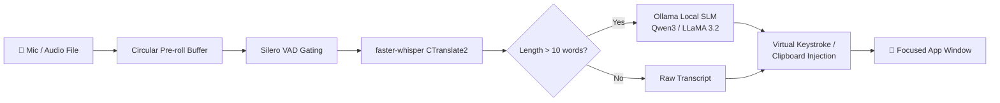

<div align="center">

# 🎙️ VoiceBud

**Fully offline, privacy-first voice dictation & audio transcription for Windows & macOS.**  
*A free, open-source local alternative to Wispr Flow powered by Whisper & Local LLMs.*

[](https://python.org)
[-FF6F00)](https://github.com/SYSTRAN/faster-whisper)
[-000000?logo=ollama&logoColor=white)](https://ollama.com)
[](https://github.com/VictorSylva/VoiceBud)
[](LICENSE)

</div>

---

## 📖 Overview

**VoiceBud** is a desktop application that brings instant, speech-to-text dictation and file transcription to your system without sending a single byte of audio to the cloud.

Whether you're drafting emails, taking notes, writing code, or transcribing recorded meetings, VoiceBud runs completely on-device. It couples high-throughput CTranslate2 speech recognition with local Small Language Models (SLMs) to strip filler words ("um", "uh", "you know"), fix punctuation, and insert clean text directly at your cursor in any active application.



---

## ✨ Key Features

- **⚡ Instant Real-Time Dictation**: Press `ctrl+shift` anywhere → speak → press again → cleaned text instantly pastes at your cursor (Notepad, VS Code, Slack, Word, Chrome, etc.).
- **🔒 100% Offline & Private**: Zero telemetry, zero cloud APIs, and zero subscription costs. Your voice and data never leave your machine.
- **🧠 Intelligent LLM Filler Removal**: Post-processes transcripts with on-device LLMs (via [Ollama](https://ollama.com)) to delete fillers (`"um"`, `"uh"`, `"like"`), fix capitalization, and resolve minor grammar slips without hallucinating or rewriting your intent.
- **⚡ Sub-Second Latency (Smart Routing)**: Utterances under 10 words bypass the LLM step entirely for instantaneous responses on short replies ("Sounds good.", "Thank you!").
- **🌊 Floating Visual Waveform**: Displays a sleek, floating waveform pill at the bottom of your screen that animates in real time to your mic amplitude so you always know when you're recording.
- **📁 Audio File Transcription (GUI)**: Right-click the system tray `🎙️` icon to open an interactive dark-mode window to transcribe `.mp3`, `.wav`, `.m4a`, `.flac`, `.ogg`, and `.aac` files with live progress, edit preview, copy to clipboard, and raw/cleaned text toggles.
- **💻 Batch CLI Mode**: Automate transcriptions straight from your terminal (`python main.py -f meeting.mp3 -o transcript.txt -c --clean`).
- **🪟 Windows & 🍎 macOS Native**: System tray integration, global keyboard hooks, pre-roll ring buffer (no clipped syllables), and automatic clipboard preservation.
- **🚀 One-Click Background Deployment**: Run as a silent Windows background service on startup or launch with a desktop shortcut using windowless `pythonw.exe`.

---

## 🛠️ Tech Stack & Architecture

| Layer | Component | Implementation | Notes |
| :--- | :--- | :--- | :--- |
| **Speech-to-Text (STT)** | `faster-whisper` | CTranslate2 + Silero VAD | Up to 4x faster than vanilla OpenAI Whisper; INT8 quantized CPU inference |
| **LLM Post-Processing** | `Ollama` | `qwen3:4b-instruct` / `llama3.2:3b` | Constrained prompt with `temperature: 0.1` and `think: false` for near-instant cleaning |
| **Audio Input** | `sounddevice` / `numpy` | 16 kHz mono float32 | 500 ms circular pre-roll buffer to prevent beginning syllable clipping |
| **Global Hotkey** | `pynput` | Multi-key chords / single keys | Configurable `toggle` (press to start/stop) or `hold` (push-to-talk) |
| **Text Injection** | `pyperclip` + Virtual Events | Synthesized `Ctrl+V` / `Cmd+V` | Automatic clipboard backup & restoration; optional per-character fallback |
| **UI & Overlays** | `pystray` + `Tkinter` | System tray & Dark GUI | System tray icon, floating waveform pill, and transcription dashboard |

---

## 🚀 Getting Started

### Prerequisites

1. **Python 3.10 - 3.14**: Download from [python.org](https://www.python.org/downloads/) (Ensure **"Add Python to PATH"** is checked during installation).
2. **Ollama (Optional, for LLM filler cleanup)**:
   - Download and install from [ollama.com](https://ollama.com).
   - Pull the recommended cleanup model:
     ```bash
     ollama pull qwen3:4b-instruct
     ```
   *(Note: If Ollama is not running, VoiceBud will automatically fall back to raw speech transcripts without crashing).*

---

### 🪟 Windows Installation

```powershell
# 1. Clone this repository
git clone https://github.com/VictorSylva/VoiceBud.git
cd VoiceBud

# 2. Create and activate a virtual environment
python -m venv .venv
.\.venv\Scripts\Activate.ps1

# 3. Install dependencies
pip install -r requirements.txt

# 4. Start VoiceBud
python main.py
```

---

### 🍎 macOS Installation

```bash
# 1. Install prerequisites via Homebrew
brew install python@3.12 ollama
ollama serve &
ollama pull qwen3:4b-instruct

# 2. Clone repository & create virtual environment
git clone https://github.com/VictorSylva/VoiceBud.git
cd VoiceBud
python3 -m venv .venv
source .venv/bin/activate
pip install -r requirements.txt

# 3. Start VoiceBud
python main.py
```

> **macOS Permissions**: On first launch, grant your terminal/app permissions under **System Settings → Privacy & Security**:
> - **Input Monitoring** (for global hotkey listening)
> - **Accessibility** (to inject text into focused applications)
> - **Microphone** (prompted upon first recording)

---

## 🎯 How to Use

### 1. Real-Time Voice Dictation
1. Click into **any** text field (Notepad, browser, Slack, Word, terminal).
2. Press **`ctrl+shift`** → A floating purple waveform appears at the bottom of your screen.
3. Speak naturally (VoiceBud strips out "ums", "ahs", and stumbles).
4. Press **`ctrl+shift`** again → Your cleaned transcript is instantly pasted at the cursor!

### 2. Audio File Transcription (GUI)
1. Right-click the **`🎙️`** microphone icon in your system tray (bottom-right taskbar near the clock).
2. Select **"Transcribe Audio File..."**.
3. Choose any audio file (`.mp3`, `.wav`, `.m4a`, `.flac`, `.ogg`, `.aac`, `.opus`).
4. View live progress, edit the output in the dark-mode window, toggle **"✨ Clean with LLM" / "↺ Show Raw"**, copy to clipboard, or save to `.txt`.

### 3. CLI Batch Transcription
Transcribe recordings directly from your terminal:
```powershell
# Transcribe and print to console
python main.py -f "meeting.mp3"

# Transcribe and copy result directly to clipboard
python main.py -f "interview.m4a" -c

# Transcribe with LLM cleanup and save to file
python main.py -f "lecture.wav" -o "notes.txt" --clean
```

---

## 🖥️ Deploying VoiceBud (Run Without an Editor or Terminal)

To use VoiceBud effortlessly every day like native software:

### Option A: Desktop Shortcut (Double-click to start anytime)
Generate a silent desktop shortcut:
```powershell
.\.venv\Scripts\python.exe create_desktop_shortcut.py
```
- A **VoiceBud** shortcut is created directly on your Desktop.
- Double-clicking it launches VoiceBud invisibly in the background using `pythonw.exe` (no command prompt window).

### Option B: Auto-Start with Windows (Zero-click everyday use)
Make VoiceBud launch automatically whenever your computer boots:
```powershell
# Enable Auto-Startup
.\.venv\Scripts\python.exe setup_startup.py

# Disable Auto-Startup
.\.venv\Scripts\python.exe setup_startup.py --remove
```

### Option C: File Explorer Launchers
Inside the repository folder, simply double-click:
- **`start_voicebud.vbs`**: Launches VoiceBud with 0 window flash.
- **`start_voicebud.bat`**: Launches via batch script.

*(To quit VoiceBud when running in the background: Right-click the `🎙️` tray icon and select **"Quit"**, or close `pythonw.exe` in Task Manager).*

---

## ⚙️ Configuration (`config.yaml`)

Customize speech models, keyboard shortcuts, and LLM parameters in `config.yaml`:

```yaml
stt:
  engine: faster-whisper      # faster-whisper | mlx-whisper (macOS Apple Silicon)
  model: tiny.en              # tiny.en (~75MB) | base (~140MB) | small (~460MB) | medium (~1.5GB) | large-v3
  language: null              # null = auto-detect, or e.g. "en", "es", "fr", "de"
  compute_type: int8          # int8 is fastest for CPU; float16 for CUDA GPU

llm:
  enabled: true               # Enable or disable LLM post-processing
  model: qwen3:4b-instruct    # Any model installed in Ollama (e.g. llama3.2:3b, qwen2.5:1.5b)
  base_url: http://localhost:11434
  temperature: 0.1            # Low temperature prevents creative rewrites
  min_words_for_cleanup: 10   # Utterances under this word count skip Ollama for instant pasting
  system_prompt: |
    You are a transcript cleaner. You receive raw speech-to-text output.
    Your ONLY job: remove filler words (um, uh, like, you know), fix
    capitalization, and fix punctuation. Output the cleaned text and NOTHING else.
    NEVER rewrite, rephrase, translate, summarize, answer questions, or add
    content. If the text is already clean, return it unchanged.

hotkey:
  key: ctrl+shift             # Single key (e.g., alt_r, ctrl_r, f13) or chord (ctrl+shift, ctrl+alt)
  mode: toggle                # toggle (press to start, press to stop) | hold (push-to-talk)

audio:
  sample_rate: 16000
  channels: 1
  preroll_ms: 500             # Circular buffer so the first word isn't clipped

inject:
  method: paste               # paste (clipboard + Ctrl+V) | type (virtual keystrokes)
  restore_clipboard: true     # Preserves your previous clipboard contents
```

---

## 🔬 AI/ML Engineering & Performance Insights

VoiceBud incorporates several key optimizations that make local voice dictation viable on consumer hardware:

1. **Quantization & CTranslate2 Engine**:
   Standard PyTorch Whisper can be resource-heavy. VoiceBud utilizes `faster-whisper`, a reimplementation using CTranslate2 (a custom C++ inference engine). Using `int8` quantization reduces memory consumption by over 60% and accelerates CPU execution up to 4x compared to native PyTorch.
2. **Silero VAD (Voice Activity Detection)**:
   Whisper models are notoriously susceptible to hallucinations (repeating phrases or generating ghost text during background silence). Enabling `vad_filter=True` gates non-speech audio segments prior to token decoding.
3. **Circular Pre-Roll Audio Buffer**:
   Human speech often begins milliseconds before or concurrently with a keypress. VoiceBud continuously maintains a 500 ms FIFO ring buffer. When recording triggers, the pre-roll buffer is prepended, preventing initial consonant truncation.
4. **Latency-Aware Dual Path Routing**:
   Running a 4-billion parameter LLM over an utterance introduces 300–800 ms of latency. For brief phrases (<10 words), grammar and filler issues are statistically negligible. VoiceBud routes short utterances directly to injection, reserving LLM compute only for multi-clause sentences.
5. **Strict Guardrail Prompting with Non-Thinking Enforcements**:
   Instruction-tuned models frequently attempt to answer questions spoken into dictation. The system prompt explicitly constrains the task to deterministic text editing, while setting `"think": false` eliminates latency penalties on reasoning-capable models (e.g., Qwen 3).

---

## 📁 Repository Structure

```
VoiceBud/
├── audio.py                  # Sounddevice recording & 500ms pre-roll circular buffer
├── cleanup.py                # Ollama SLM client, prompt engineering, & fallback routing
├── config.yaml               # Master application configuration
├── hotkey.py                 # Pynput global keyboard hook (toggle & hold modes)
├── inject.py                 # Cross-platform text injection (clipboard & keystrokes)
├── main.py                   # App entry point, CLI parser, & system tray lifecycle
├── overlay.py                # Live waveform amplitude indicator UI
├── setup_startup.py          # Windows Startup service installer/uninstaller
├── create_desktop_shortcut.py# Windows silent desktop shortcut generator
├── start_voicebud.vbs        # Zero-console window launcher script
├── start_voicebud.bat        # Batch launcher script
├── transcribe.py             # faster-whisper CTranslate2 STT wrapper
├── transcribe_window.py      # Tkinter audio file transcription GUI
├── requirements.txt          # Python dependencies
└── README.md                 # Project documentation
```

---

## 🤝 Contributing

Contributions are welcome! Whether it's adding support for new languages, optimizing audio filters, or extending platform support:

1. Fork the Project
2. Create your Feature Branch (`git checkout -b feature/AmazingFeature`)
3. Commit your Changes (`git commit -m 'Add some AmazingFeature'`)
4. Push to the Branch (`git push origin feature/AmazingFeature`)
5. Open a Pull Request

---

## 📄 License

Distributed under the MIT License. See [LICENSE](LICENSE) for details.

---

<div align="center">
Built with ❤️ for privacy, open source, and local AI.
</div>
